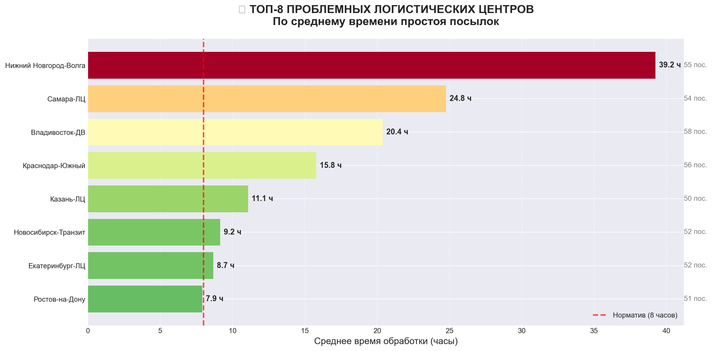
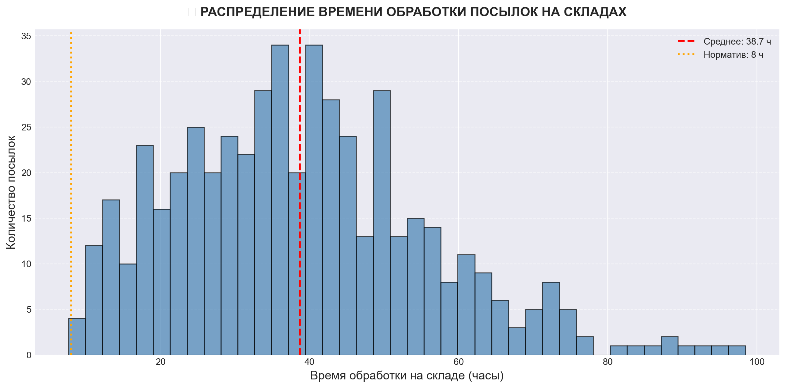
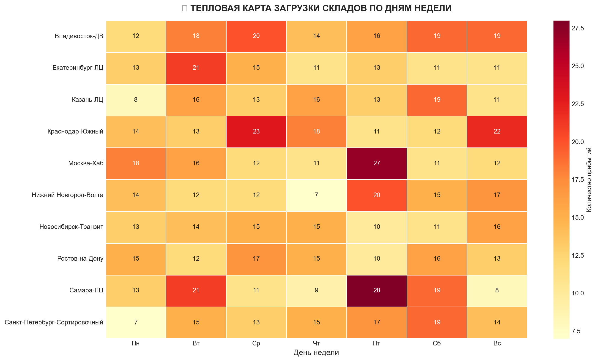

# 🚚 Logistics Route Analyzer

[](https://python.org)
[](https://sqlite.org)
[](https://pandas.pydata.org)
[](https://matplotlib.org)
[](https://opensource.org/licenses/MIT)

> **Учебный проект по анализу логистических маршрутов**  
> Поиск узких мест в цепочке поставок с помощью SQL и визуализация в Python.

---

## 🎯 Проблематика

Виртуальная логистическая компания сталкивается с **систематическим нарушением сроков доставки**.  
Данные о перемещении посылок разрознены и требуют аналитической обработки.

### Задачи проекта:

| № | Задача | Инструмент |
|---|--------|------------|
| 1 | Собрать историю перемещений посылок | SQL (SQLite) |
| 2 | Найти склады с аномально долгим временем обработки | Оконные функции SQL |
| 3 | Визуализировать «бутылочное горлышко» | Python (Matplotlib, Seaborn) |
| 4 | Сформулировать рекомендации | Jupyter Notebook |

---

## 🛠 Стек технологий

| Категория | Инструменты |
|-----------|-------------|
| **Язык** | Python 3.9+ |
| **Обработка данных** | Pandas, NumPy |
| **База данных** | SQLite 3 |
| **Визуализация** | Matplotlib, Seaborn |
| **Генерация данных** | Faker |
| **Интерактивный анализ** | Jupyter Notebook |
| **Контроль версий** | Git, GitHub |

---

## 🚀 Быстрый старт

### 1. Клонировать репозиторий

```bash
git clone https://github.com/beaulo0o/logistics-route-analyzer.git
cd logistics-route-analyzer
```

2. Создать виртуальное окружение
Windows:


```bash
python -m venv venv
venv\Scripts\activate
```
Mac / Linux:


```bash
python3 -m venv venv
source venv/bin/activate
```

3. Установить зависимости


```bash
pip install -r requirements.txt
```

4. Запустить пайплайн анализа


```bash
# Генерация синтетических данных (500 посылок)
python src/data_generator.py

# Загрузка данных в SQLite и создание представлений
python src/db_loader.py

# Анализ узких мест (вывод в консоль)
python src/analyzer.py

# Визуализация результатов (сохранение PNG)
python src/visualizer.py
```

5. Открыть Jupyter Notebook (опционально)
   
```bash
jupyter notebook notebooks/01_analysis_demo.ipynb
```
## 📊 Результаты анализа
🔴 Топ проблемных складов
Склады с наибольшим средним временем обработки посылок (в часах).
Красная пунктирная линия — норматив (8 часов).

<p align="center">  </p>
📊 Распределение времени обработки
Гистограмма показывает, что большинство посылок обрабатывается в пределах 10 часов,
но есть длинный хвост аномальных задержек (до 60+ часов).

<p align="center">  </p>
🔥 Тепловая карта загрузки по дням недели

Наибольший поток прибытий приходится на **понедельник и вторник**.  
Это создаёт пиковую нагрузку на сортировочные центры.

<p align="center">  </p>

## 📝 Выводы

| 🚨 Проблема | 📍 Локация | 💡 Рекомендация |
|-------------|------------|-----------------|
| Аномально высокая задержка | Нижний Новгород-Волга (15+ ч) | Аудит сортировочного оборудования |
| Аномально высокая задержка | Самара-ЛЦ (12+ ч) | Проверка штатного расписания |
| Пиковая нагрузка | Все склады (Пн-Вт) | Усиление смен в начале недели |
| Длинный хвост задержек | Отдельные посылки > 48 ч | Внедрение системы алертов |

## 📈 Ожидаемый эффект от внедрения рекомендаций
Сокращение среднего времени обработки на 25-30%

Снижение количества посылок с задержкой >24ч на 40%

Повышение удовлетворённости клиентов

## 📄 Лицензия
Проект распространяется под лицензией MIT.
Подробности в файле LICENSE.

## 👤 Автор
beaulo0o
https://img.shields.io/badge/GitHub-beaulo0o-181717?style=flat&logo=github

<p align="center"> <sub>⭐ Если проект оказался полезным, поставь звёздочку на GitHub!</sub> </p> 
